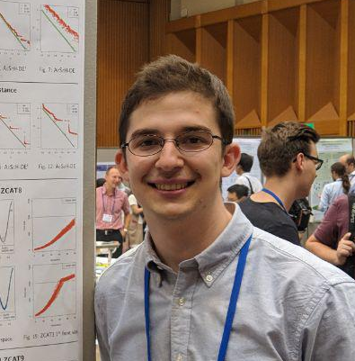

## About Me

I'm a Master student in Electronic and Information Engineering at Shinshu University, Japan. I earned my B.S. degree in Electronic Engineering from Federal University of Technology – Paraná (UTFPR), Brazil in 2016. During my graduation, I studied one year at Concordia University, Canada as a participant of Science Without Borders program. My research interests include evolutionary computation, multi- and many-objectives optimization, artificial intelligence.

## NEWS

* 2018 July: I attended [GECCO](http://gecco-2018.sigevo.org/) in Kyoto where I had a poster presentation about our study of MOEAs behavior on problems with difficult PS topology.
* 2018 July: I attended [SIGEvo Summer School 2018](https://sigevo-summer-school-2018.github.io/) in Osaka, Japan.
* 2018 July: I gave a presentation entitled "Multi-objective Optimization Problems with a Complex Topology" at [1st International Workshop on Computational Intelligence for Massive Optimization](https://sites.google.com/view/cimo-workshop) (CIMO 2018).
* 2018 April: Our paper has been accepted to [GECCO](http://gecco-2018.sigevo.org/) as poster.
  * Y. Marca, H. Aguirre, S. Zapotecas, A. Liefooghe, B. Derbel, S. Verel, K. Tanaka: Pareto dominance-based MOEAs on problems with difficult pareto set topologies.

## Contact

* E-mail: yurimarca [at] gmail . com
* Phone: +81 70 4370 2791

## Online CVs

* [Google Scholar](https://scholar.google.com/citations?user=YBoCAToAAAAJ&hl=en)
* [LinkedIn](https://www.linkedin.com/in/yurimarca/)
* [Lattes Platform](http://lattes.cnpq.br/3992305361737583) -- *Brazilian government's research registry*
