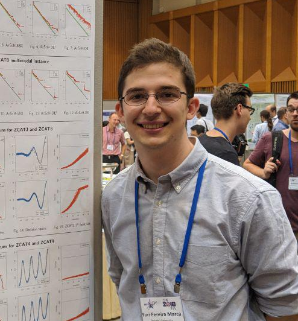

## About Me

I'm a Master student in Electronic and Information Engineering at Shinshu University, Japan. I earned my B.S. degree in Electronic Engineering from Federal University of Technology – Paraná (UTFPR), Brazil in 2016. During my graduation, I studied one year at Concordia University, Canada as a participant of Science Without Borders program. My research interests include evolutionary computation, multi- and many-objectives optimization, artificial intelligence.  

## News

* 2018 July: I gave a presentation entitled "Multi-objective Optimization Problems with a Complex Topology" at (1st International Workshop on Computational Intelligence for Massive Optimization)[https://sites.google.com/view/cimo-workshop] (CIMO 2018)

## Publications

1. F.Bar, J.Doe: Effects of having a placeholder of a name
2. S.Holmes, J.Watson: Consequences of living with a sociopath in London

## Typography

This is a [link](http://google.com). Something *italics* and something **bold**.

Here is a table

Year | Award | Category
-----|-------|--------
2014 | Emmy  | Won Outstanding Lead Actor in a miniseries or a movie
2015 | BAFTA | Nominated for Best Leading Actor for Sherlock
2014 | Satellite | Won Best Actor miniseries or television film

Here is a horizontal rule

---

Here is a blockquote

> To a great mind, nothing is little

## References

* Foo Bar: Head of Department, Placeholder Names, Lorem
* John Doe: Associate Professor, Department of Computer Science, Ipsum
