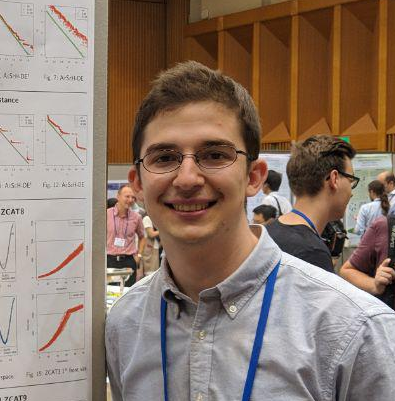

## SUMMARY

I am a PhD Student in the Operational Research group of Warwick Business School, U.K. I have earned my Master degree in Electronic and Information Engineering from Shinshu University, Japan, and my Bachelor degree in Electronic Engineering from Federal University of Technology – Paraná (UTFPR), Brazil. During my undergraduate studies, I studied one year at Concordia University, Canada as an exchange student participant of the program Science Without Borders. My research interests include Evolutionary Computation, Multi-objective Optimization, and Operational Research.

## NEWS

* 2019 November: Participant of the [COST Action Training school CA15140](https://imappnio.dcs.aber.ac.uk/training-school-2019/training-school-2019) at University of Coimbra, Portugal.
* 2019 October: I have started the PhD course at [Warwick Business School](https://www.wbs.ac.uk/courses/doctoral/phd/), United Kingdom.
* 2019 July: Our paper has been accepted to be published on Japan Evolutionary Computation Society's Journal.
  * Y. Marca, H. Aguirre, S. Zapotecas, A. Liefooghe, B. Derbel, S. Verel, K. Tanaka: MOEA with Cubic Interpolation on Bi-objective Problems with Difficult Pareto Set Topology
* 2019 March: I have graduated from Shinshu University, Japan.
  * Thesis' title: Interpolation Model Based Evolutionary Algorithm to Solve Multi-objective Optimization Problems with Difficult Pareto Set Topology.
* 2019 March: I received the Best Student Paper Award at [EMO2019](https://www.emo2019.org/) for the paper:
  * Y. Marca, H. Aguirre, S. Zapotecas, A. Liefooghe, B. Derbel, S. Verel, K. Tanaka: Approximating Pareto set topology by cubic interpolation on bi-objective problems.
* 2018 December: I received the [Young Researcher Award](http://www.ieee-jp.org/section/tokyo/chapter/CIS-11/index.php?TopPage-J%2FYRA-J%2F2018#v11d4fc5) from [JPNSEC 2018 Symposium on Evolutionary Computation](http://www.jpnsec.org/symposium201803.html) for the paper:
  * Y. Marca, H. Aguirre, S. Zapotecas, A. Liefooghe, B. Derbel, S. Verel, and K. Tanaka.: NSGA-II with Spline Interpolation on Bi-objective Problems with Difficult Pareto Set Topology.

[Past activities](pastnews.md)

## Contact

* yurimarca [at] g m a i l [dot] c o m

## Online CVs

* [Google Scholar](https://scholar.google.com/citations?user=YBoCAToAAAAJ&hl=en)
* [LinkedIn](https://www.linkedin.com/in/yurimarca/)
* [Lattes Platform](http://lattes.cnpq.br/3992305361737583) -- *Brazilian government's research registry*
